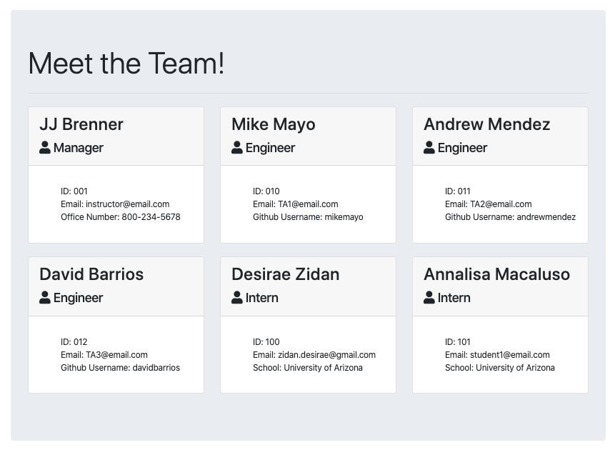
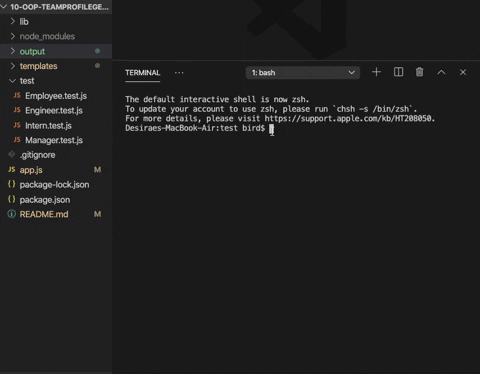

# Unit 10 OOP Homework: Template Engine - Employee Summary
This challenge is to build a Node CLI that takes in information about employees and generates an HTML webpage that displays summaries for each person. Since testing is a key piece in making code maintainable, you will also be ensuring that all unit tests pass.


## Instructions
You will build a software engineering team generator command line application. The application will prompt the user for information about the team manager and then information about the team members. The user can input any number of team members, and they may be a mix of engineers and interns. This assignment must also pass all unit tests. When the user has completed building the team, the application will create an HTML file that displays a nicely formatted team roster based on the information provided by the user.
```
As a manager
I want to generate a webpage that displays my team's basic info
so that I have quick access to emails and GitHub profiles
```
How do you deliver this? Here are some guidelines:
* Use the [Inquirer npm package](https://github.com/SBoudrias/Inquirer.js/) to prompt the user for their email, id, and specific information based on their role with the company.
* Your app will run as a Node CLI to gather information about each employee.
* Use [jest](https://jestjs.io/) for running the provided tests.

### Classes
The project must have the these classes: `Employee`, `Manager`, `Engineer`,
`Intern`. The tests for these classes in the `tests` directory must all pass.

### User input
The project must prompt the user to build an engineering team. An engineering
team consists of a manager, and any number of engineers and interns.

### Roster output
The project must generate a `team.html` page in the `output` directory, that displays a nicely formatted team roster. Each team member should display the following in no particular order:
  * Name
  * Role
  * ID
  * Role-specific property (School, link to GitHub profile, or office number)


## Finished Assignment:
Please view the deployed project: https://zidandesirae.github.io/10-OOP-TeamProfileGenerator/

Github Repository: https://github.com/zidandesirae/10-OOP-TeamProfileGenerator

### Visuals




